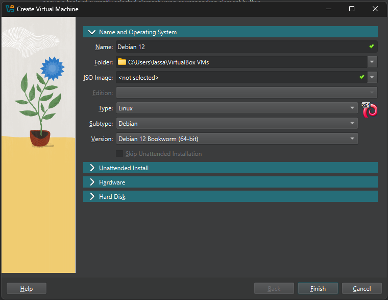
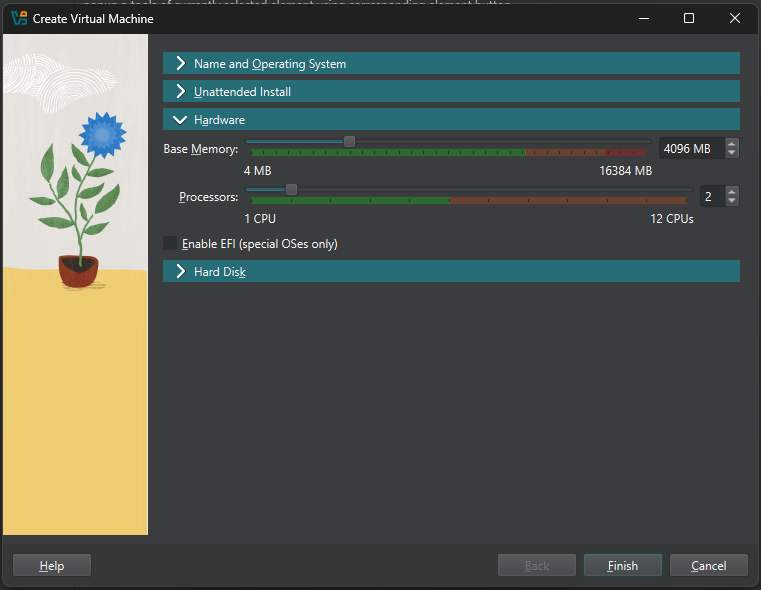
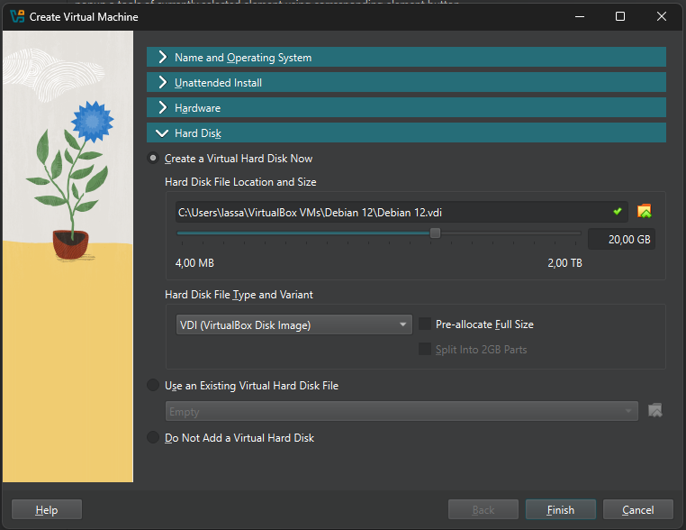

# Oma linux

Tehtävänanto: https://terokarvinen.com/linux-palvelimet/#h1-oma-linux

## Raportin kirjoittaminen
- Raportissa kerrotaan mitä tehtiin ja mitä tapahtui. Sen tulee olla toistettava, täsmällinen ja helppolukuinen.
- Raporttia kirjoitetaan jotta muistetaan jälkikäteen mitä on tehty, ajatusten selkeyttämiseksi ja muita auttamaan.

## Free software
- Free software, suomeksi vapaa ohjelmisto, on ohjelmisto jonka käyttäjällä on laajemmat vapaudet verrattuna normaaliin ohjelmistoon.
- Vapaan ohjelmiston tunnistaa neljästä keskeisestä piirteestä: 1. Vapaus ajaa koodia niin kuin itse haluaa. 2. Vapaus tutkia lähdekoodia ja muokata sitä. 3. Vapaus levittää kopioita ohjelmasta. 4. Vapaus levittää muokattuja kopioita ohjelmasta.

## Linuxin asentaminen virtuaalikoneeseen
Tietokone: Lenovo Legion Y540-15IRH\
Käyttöjärjestelmä: Windows 11 23h2

Aloitin tehtävän asentamalla uusimman Debian ISO tiedoston debian-live-12.9.0-amd64-xfce.iso sivustolta https://www.debian.org/CD/live/ klikkaamalla "Live Xfce" linkkiä. Tiedoston koko oli 3,0 Gt, ja sen lataukseen meni alle minuutti. Virtualisointiohjelmistona tehtävää tehdessä toimi VirtualBox, sillä se olin sen aiemmin ladannut. Debian ISO tiedoston latauksen jälkeen avasin VirualBoxin ja aloitin uuden virtuaalikoneen luonnin Ctrl+N komennolla. Avautuvassa ikkunassa valitsin alla olevien kuvien mukaiset valinnat, ja klikkasin "Finish".

Avasin virtuaalikoneen tuplaklikkaamalla luomaani virtuaalikonetta. Hetken kuluttua bootloader-valikko avautui ja valitsin "Live system (amd64)" painamalla enter-näppäintä. Avautui työpöytä jossa kokeilin heti koneen toimivuutta avaamalla iselaimena ja Youtube-videon. Näin sain selville ainakin hiiren, näppäimistön, internet-yhteyden, kuvan ja äänen toimivuuden. 

## Debian asennus

Jatkoin työpöydälle ja avasin Debian GNU/Linux Installerin tuplaklikkaamalla "Install Debian kuvaketta". 

1. Installerissa Welcome-sivulla kieleksi valitsin "American English".
2. Location-sivulla sijainniksi valitsin "Europe","Helsinki".
3. Keyboard-sivulla valitsin asetukset "Generic 105-key PC", "Finnish", "Default"
4. Partitions-sivulla valitsin "Erase disk", en salannut järjestelmää, ja Boot loader location: "Master Boot Record of VBOX HARDDISK (/dev/sda)"
5. Users-sivulla syötin nimen, käyttäjätunnuksen, tietokoneen nimen ja salasanan. En valinnut kohtaa "Log in automatically without asking for the password."
6. Summary-sivulla varmistin tiedot ja klikkasin "Install"-nappia.
7. Asennus alkoi kello 18.40 ja päättyi 18.51.
8. Finish-sivulla valitsin "Restart now" ja klikkasin "Done"-nappia

Kone käynnistyi uudelleen, joka vei muutaman minuutin. Uudelleenkäynnistyksen jälkeen kirjauduin sisään luomallani käyttäjätunnuksella ja salasanalla. Lopuksi vielä varmistin uudelleen järjestelmän toimivuuden selaamalla nettiä ja katsomalla Youtube-videota.

Asennuksessa käytetyt ohjeet: https://terokarvinen.com/2021/install-debian-on-virtualbox/
